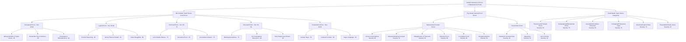

```mermaid
graph TD
    A[Unified Taxonomy of Errors in Mathematical Proofs]

    A --> M[Micro Model: Taylor Series Proof Errors]
    A --> T[Tiny Model: General Proof Errors]
    A --> S[Small Model: Taylor Series Categories]

    %% MICRO MODEL
    M --> M1[Conceptual Errors - Sev: 85-95]
    M --> M2[Logical Errors - Sev: 80-90]
    M --> M3[Technical Errors - Sev: 65-75]
    M --> M4[Structural Errors - Sev: 60-80]
    M --> M5[Presentation Errors - Sev: 30-50]

    M1 --> M1a[Wrong Definition of Taylor Series - 95]
    M1 --> M1b[Remainder Term Confusion - 85]
    M1 --> M1c[Convergence Misunderstood - 90]

    M2 --> M2a[Circular Reasoning - 85]
    M2 --> M2b[Wrong Theorem Stated - 90]
    M2 --> M2c[Rules Misapplied - 80]

    M3 --> M3a[Limit Notation Misuse - 75]
    M3 --> M3b[Derivative Errors - 65]
    M3 --> M3c[Inconsistent Notation - 70]

    M4 --> M4a[Missing Assumptions - 70]
    M4 --> M4b[No Convergence Discussion - 80]
    M4 --> M4c[Only Simple Case Shown - 60]

    M5 --> M5a[Unclear Steps - 50]
    M5 --> M5b[Irrelevant Content - 30]
    M5 --> M5c[Vague Language - 40]

    %% TINY MODEL
    T --> T1[Mathematical Content Errors]
    T --> T2[Presentation Errors]

    T1 --> T1a[Incorrect Assumptions\nSeverity: 68]
    T1 --> T1b[Misunderstanding Concepts\nSeverity: 78]
    T1 --> T1c[Misapplication of Theorems\nSeverity: 58]
    T1 --> T1d[Inductive Errors\nSeverity: 68]
    T1 --> T1e[Incomplete Proofs\nSeverity: 48]
    T1 --> T1f[Overgeneralization\nSeverity: 58]

    T2 --> T2a[Notational Inconsistencies\nSeverity: 24]
    T2 --> T2b[Vagueness\nSeverity: 34]
    T2 --> T2c[Lack of Clarity\nSeverity: 42]

    %% SMALL MODEL
    S --> S1[Theorem and Principle Errors\nSeverity: 90]
    S --> S2[Computational/Derivational Errors\nSeverity: 75]
    S --> S3[Assumption/Condition Omissions\nSeverity: 95]
    S --> S4[Conceptual/Theoretical Gaps\nSeverity: 75]
    S --> S5[Structural/Logical Flaws\nSeverity: 70]
    S --> S6[Presentation/Clarity Issues\nSeverity: 25]
```